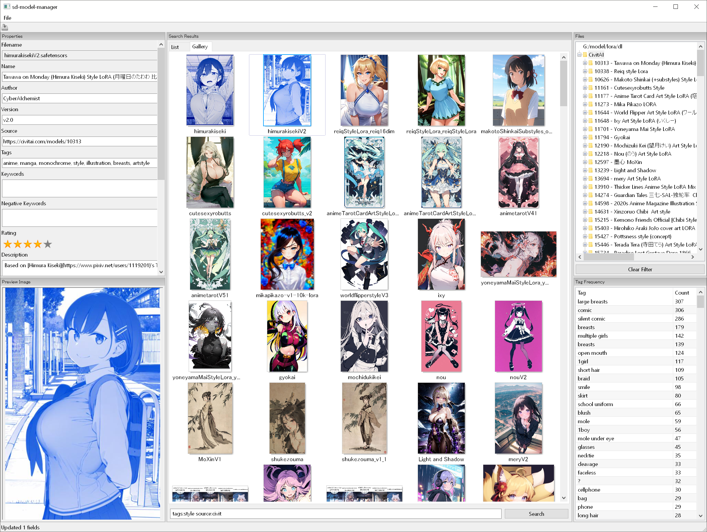

# sd-model-manager

A desktop application and companion web server for browsing and managing Stable Diffusion models (embeddings, LoRAs, etc.) and their metadata.

Can be used standalone with the included frontend, embedded into ComfyUI for use with their ecosystem, or repurposed as an independent API server.

**NOTE:** Still alpha-quality for the time being.



## Usage

First install the requirements:

```bash
# Required
pip install -r requirements/development.txt

# Optional, if developing
pip install -r requirements/gui.txt
```

Next edit `config.yml` to contain your model paths:

```yaml
listen: 0.0.0.0
port: 7779
model-paths:
  - "C:/path/to/loras"
```

Then the built-in GUI can be run as follows:

```
python client.py
```

To run the API server standalone with hot reloading:

```
adev runserver -p 7779 main.py
```

Your model metadata will be saved to `model_database.db` in case you want to backup/inspect it.

### ComfyUI Extension

You can use this repo as a ComfyUI extension to embed the server into its existing API. Simply clone/move this repo into the `custom_nodes` folder of your ComfyUI install, then start ComfyUI as usual.

To connect to the model management server when it's running under ComfyUI, use this command:

```
python client.py --mode comfyui
```

All API routes will be moved under a `models/` namespace, like `http://localhost:8188/models/api/v1/loras`.

## Search Query Syntax

When using a `query` parameter to search for models, you can use some special syntax to filter your results:

### Basic Searches
An unqualified search term like `some text` will search for the text in the model's name or filepath.

You can search by a fuzzy value with qualifiers like `id:123` or `name:"detailed lighting"`.

Additionally, for numeric queries you can use comparison operators like `rating:>=7`. The full list of operators:

- `==`
- `!=`
- `>`
- `<`
- `>=`
- `<=`

Any search qualifier can be negated by prepending `-` to the front: `-name:"bad quality"`

Some criteria can also be used with the `has:` qualifier to check for existence of the field: `has:image`

### List of Qualifiers

#### Strings:

- `root_path:*`
- `filepath:*`
- `filename:*`
- `name:*`
- `author:*`
- `source:*`
- `keywords:*`
- `description:*`
- `tags:*`
- `tag:*`
- `notes:*`
- `network_module:*`
- `module_name:*`
- `module:*`
- `network_dim:*`
- `dim:*`
- `network_alpha:*`
- `alpha:*`
- `model_hash:*`
- `hash:*`
- `legacy_hash:*`

#### Numbers:

- `id:*`
- `rating:*`
- `unique_tags:*`
- `num_epochs:*`
- `epochs:*`
- `epoch:*`
- `session_id:*`
- `resolution:*`
- `keep_tokens:*`
- `learning_rate:*`
- `lr:*`
- `text_encoder_lr:*`
- `tenc_lr:*`
- `unet_lr:*`
- `noise_offset:*`
- `num_train_images:*`
- `train_images:*`
- `num_reg_images:*`
- `reg_images:*`

#### Has:

- `has:name`
- `has:version`
- `has:author`
- `has:source`
- `has:keywords`
- `has:negative_keywords`
- `has:description`
- `has:tags`
- `has:rating`
- `has:image`
- `has:preview_image`
- `has:vae`
- `has:tag_frequency`
- `has:dataset_dirs`
- `has:reg_dataset_dirs`
- `has:network_args`
- `has:noise_offset`
- `has:keep_tokens`

### Ordering

You can sort the results returned from the database with the `order:` qualifier: `order:rating`

To reverse the order: `order:reverse:dim`

### List of Ordering Types

- `order:id`
- `order:root_path`
- `order:filepath`
- `order:filename`
- `order:name`
- `order:version`
- `order:author`
- `order:source`
- `order:keywords`
- `order:negative_keywords`
- `order:description`
- `order:tags`
- `order:rating`
- `order:notes`
- `order:network_dim`
- `order:dim`
- `order:network_alpha`
- `order:alpha`
- `order:resolution`
- `order:unique_tags`
- `order:keep_tokens`
- `order:noise_offset`
- `order:num_train_images`
- `order:train_images`
- `order:num_reg_images`
- `order:reg_images`

## API Reference

The following examples assume standalone mode with the default configuration (port `7779`).

### GET /api/v1/loras

List all LoRAs.

**Query Parameters**

- `page`: Page marker for the current page, returned in the `paging` struct in previous requests
- `limit`: Number of entries to return (default 100)
- `query`: Search query

**Example**

```hurl
GET http://localhost:7779/api/v1/loras?limit=10
```

```jsonc
{
  "paging": {
    "next": ">",
    "current": ">",
    "previous": "<",
    "limit": 1
  },
  "data": [
    {
      "id": 1,
      "name": "Test LoRA",
      "author": "space-nuko",
      "network_module": "networks.lora",
      "learning_rate": 0.0001
      "text_encoder_lr": 0.00005
      "unet_lr": 0.00005
      // ...
    }
  ]
}
```

### GET /api/v1/lora/{id}

Get information for one LoRA.

**Query Parameters**

(None)

**Example**

```hurl
GET http://localhost:7779/api/v1/lora/1
```

```jsonc
{
  "data": {
    "id": 1,
    "name": "Test LoRA",
    "author": "space-nuko",
    "network_module": "networks.lora",
    "learning_rate": 0.0001
    "text_encoder_lr": 0.00005
    "unet_lr": 0.00005
    // ...
  }
}
```

### PATCH /api/v1/lora/{id}

Update information for one LoRA.

**Body Parameters**

- `changes`: List of key/value pairs to update in the model

**Example**

```hurl
PATCH http://localhost:7779/api/v1/lora/1
{
  "changes": {
    "display_name": "New Name",
    "version": "V2",
    "rating": 5,
    "preview_images": [
      {
        "filepath": "C:/path/to/image.png"
      }
    ]
  }
}
```

```jsonc
{
  "status": "ok",
  "fields_updated": 4
}
```

### GET /api/v1/preview_image/{id}

Get information for one preview image.

**Query Parameters**

(None)

**Example**

```hurl
GET http://localhost:7779/api/v1/preview_image/1
```

```jsonc
{
  "data": {
    "id": 1,
    "filepath": "C:/path/to/image.png",
    "is_autogenerated": false
  }
}
```


### GET /api/v1/preview_image/{id}/view

Download the image file represented by a preview image.

**Query Parameters**

(None)

**Example**

```hurl
GET http://localhost:7779/api/v1/preview_image/1/view
```

```
<binary data>
```
